ThatMicPre
=====
A simple, high-quality DIY microphone pre-amplifier with switched gain.

The background for this project was that I needed a simple but good microphone preamp for doing acoustic measurements. I needed a switched gain to be able to reproduce the gain setting in a more predictable way than what is possible with a potmeter. I could not find any existing DIY designs, so I decided to make one.

The design is based on the excellent [THAT1510 or THAT1512](https://thatcorp.com/that-1510-1512-low-noise-high-performance-audio-preamplifiers/) preamp ICs. It is also compatible with [SSM2019](https://www.analog.com/en/products/ssm2019.html) or [INA217](https://www.ti.com/product/INA217). I have followed all THAT's datasheets and app-notes to implement a robust, best-practice design.

A goal was to use simple through-hole parts that I and other DIYers usually have in our parts drawer. So there are no additional IC's or voltage regulators for example, it just uses simple transistors, capacitors and zener diodes for supply filtering and regulation. I selected affordable switches and connectors to keep cost down. Many parts can be substituted without sacrificing performance.

There are two versions of this design, one suited for a desktop encolsure with gain switch on top, and one suited for a rack-mount enclosure with gain switch on the front.

This is an open-source project released under CC-BY-SA-4.0 license. It basically means you can use it as you want as long as you share modifications under the same license, and attribute back to this project. See [LICENSE.txt](../blob/master/LICENSE.txt) for details.

See discussion of this project in this [DIYAudio thread.](https://www.diyaudio.com/forums/equipment-and-tools/356317-thatmicpre-source-mic-preamp.html) If you decide to build this pre-amplifier, please post results of your build there.

Specifications
-----
* Microphone preamplifier with switched gain and 48V phantom power.
* XLR input and output connectors.
* Phantom power on/off switch.
* Phase invert switch.
* Gains (dB): 0, 10, 15, 20, 25, 30, 35, 40, 45, 50, 55, 60.
* Gain deviation from nominal: Max +/-0.5dB using R12-series resistors.
* Frequency response: 0/-3dB from 10Hz to 100kHz for all gain settings.
* Input impedance: 2.0kohm differential (1kHz)
* Impedance balanced output, output impedance 200ohm (1kHz)
* Max output level: 20dBu at 0.1% THD (1kHz).
* THD+N less than 0.005% at 1kHz at 18dBu output level for all gain settings (20-20kHz BW).
* 48V DC power supply required, 30mA max. 
  * (Will operate with lower voltage DC power supplies with reduced phantom voltage and max output level).
* PCB dimensions 75mm x 120mm, fits the [Hammond 1455K120x](https://www.hammfg.com/part/1455K1201) enclosure.
  * Desktop version has gain switch on top of enclosure for easy access.
  * Rack version has gain switch on front for easy mounting in a rack enclosure.

Schematic
-----
#### Desktop version

#### Rack version
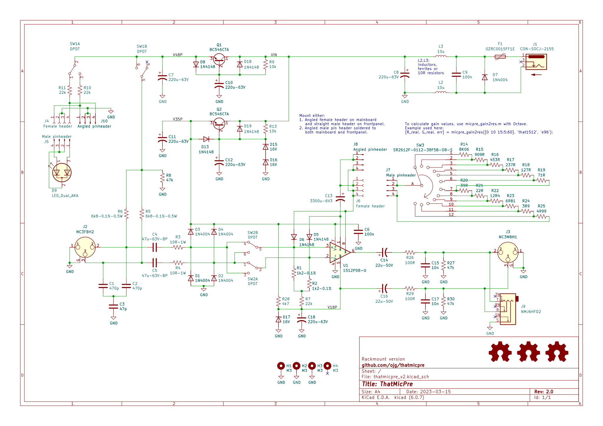

PCB
-----
3D PCB render (v1.1)
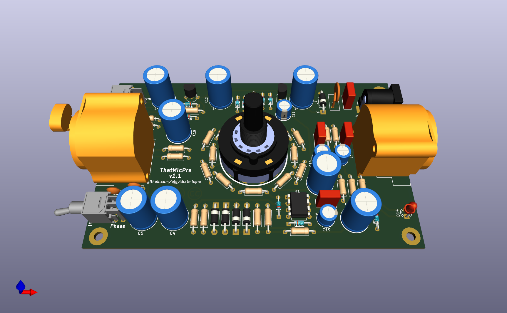

Photo of completed prototype (v1.1, credit jsenderatx on diyaudio)
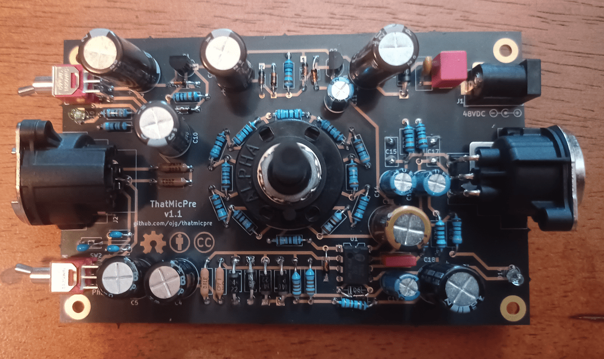

## Panels

There is a separate PCB project in the panels folder that contains PCB layout for front and back panels that fits the 1455K120x case. Since it is copper-clad on the inside, it makes for a nice shielded box.

## Bill of Materials
Nicely formatted BOM is in the plots folder for [desktop version](https://htmlpreview.github.io/?https://github.com/ojg/thatmicpre/blob/master/desktop/plots/thatmicpre_bom.html)
and [rack version](https://htmlpreview.github.io/?https://github.com/ojg/thatmicpre/blob/master/rack/plots/thatmicpre_bom.html).

Thanks to the [InteractiveHtmlBom project](https://github.com/openscopeproject/InteractiveHtmlBom).

Measurements
-----
### Output noise vs gain
20-22kHz BW un-wtd, 150ohm source impedance.
Note: Theoretical minimum EIN with 150ohm source impedance is -130.4dBu.

| Gain(dB) | THAT1510 Output Noise (dBu) | THAT1510 EIN (dBu) | THAT1512 Output Noise (dBu) | THAT1512 EIN (dBu) |
| --- | --- | --- |--- | --- |
| 0 | -98.5 | -98.5 | -102.4 | -102.4 |
| 10 | -98.2 | -108.2 | -102.0 | -112.0 |
| 15 | -97.8 | -112.8 | -101.3 | -116.3 |
| 20 | -96.8 | -116.8 | -100.0 | -120.0 |
| 25 | -95.6 | -120.6 | -98.0 | -123.0 |
| 30 | -93.2 | -123.2 | -95.2 | -125.2 |
| 35 | -89.8 | -124.8 | -91.5 | -126.5 |
| 40 | -86.8 | -126.8 | -87.3 | -127.3 |
| 45 | -82.6 | -127.6 | -82.8 | -127.8 |
| 50 | -77.8 | -127.8 | -78.1 | -128.1 |
| 55 | -73.1 | -128.1 | -73.3 | -128.3 |
| 60 | -68.3 | -128.3 | -68.6 | -128.6 |

### Frequency Response
#### THAT1510 with 1% R12 resistors
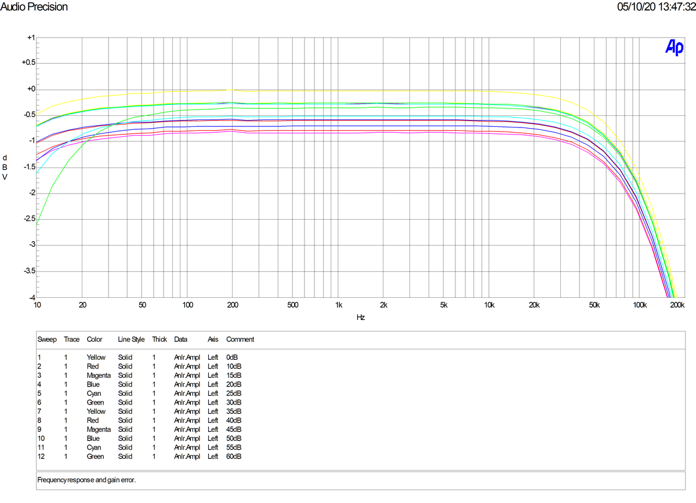
#### THAT1512 with 1% R96 resistors
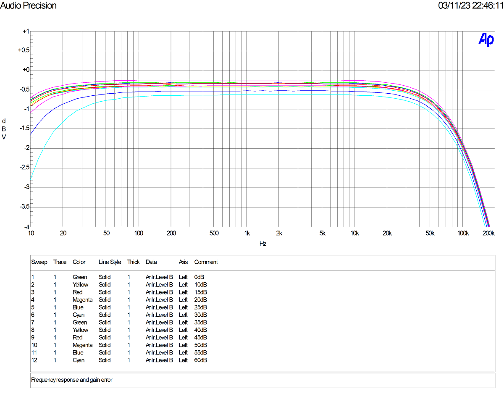

### THD+N vs Frequency
#### THAT1510
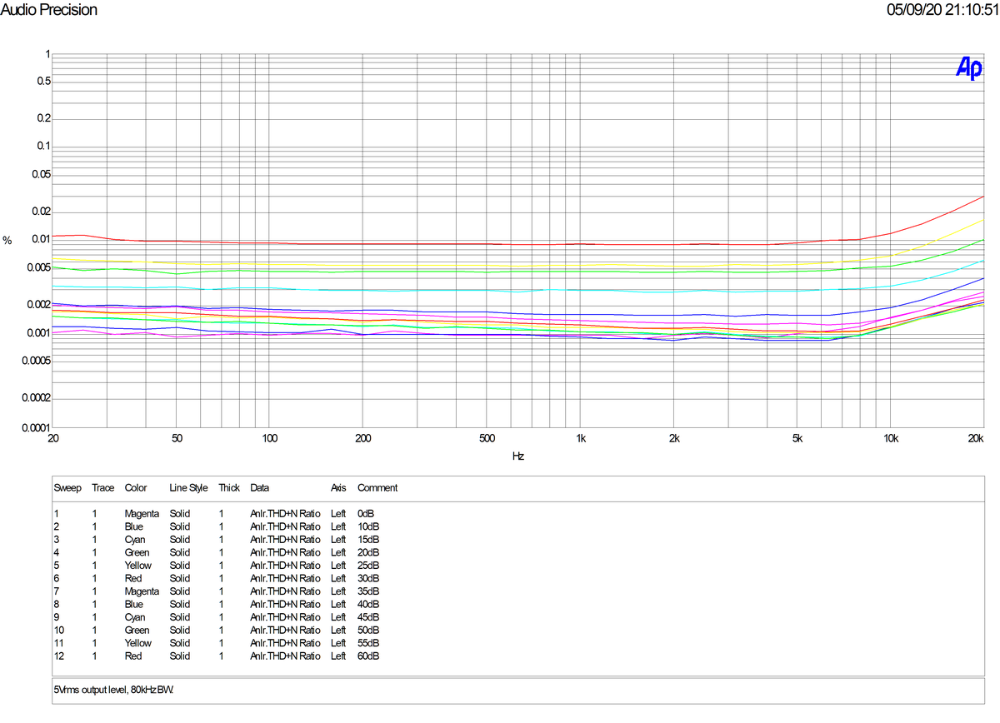
#### THAT1512
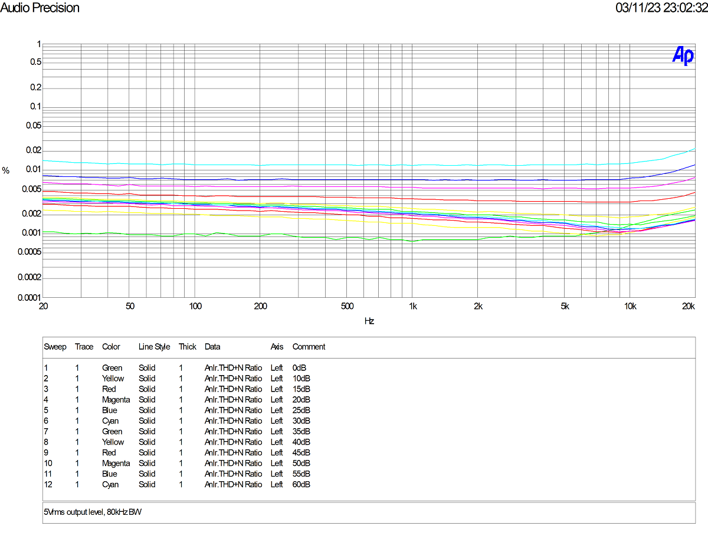

### THD+N vs Amplitude
#### THAT1510
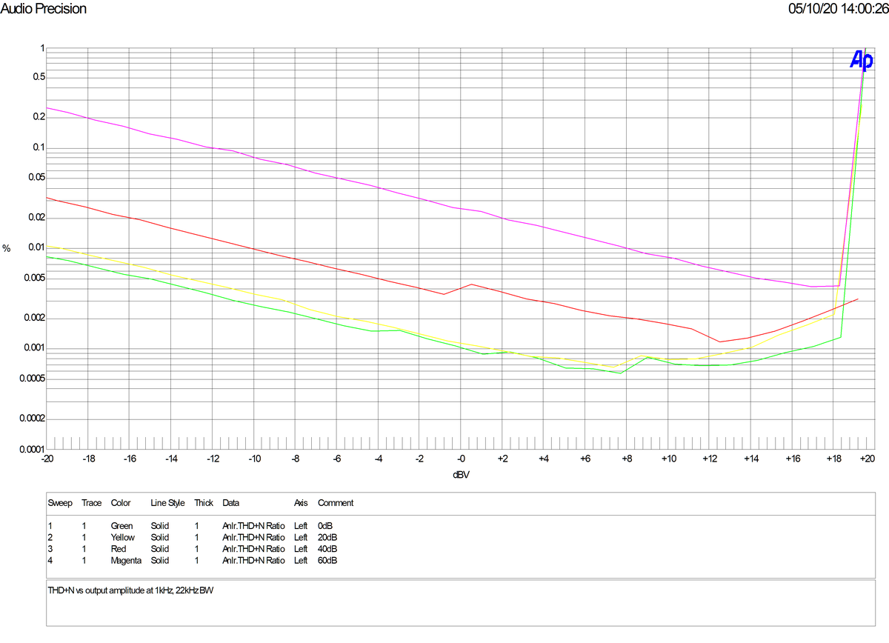
#### THAT1512
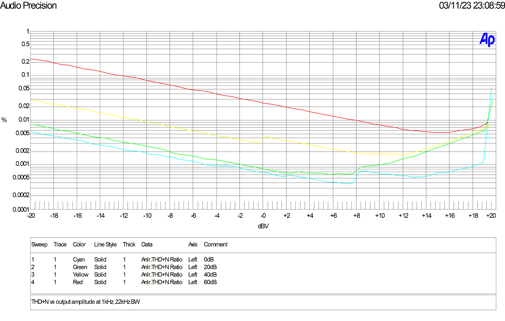

### Common Mode Rejection Ratio
#### THAT1510
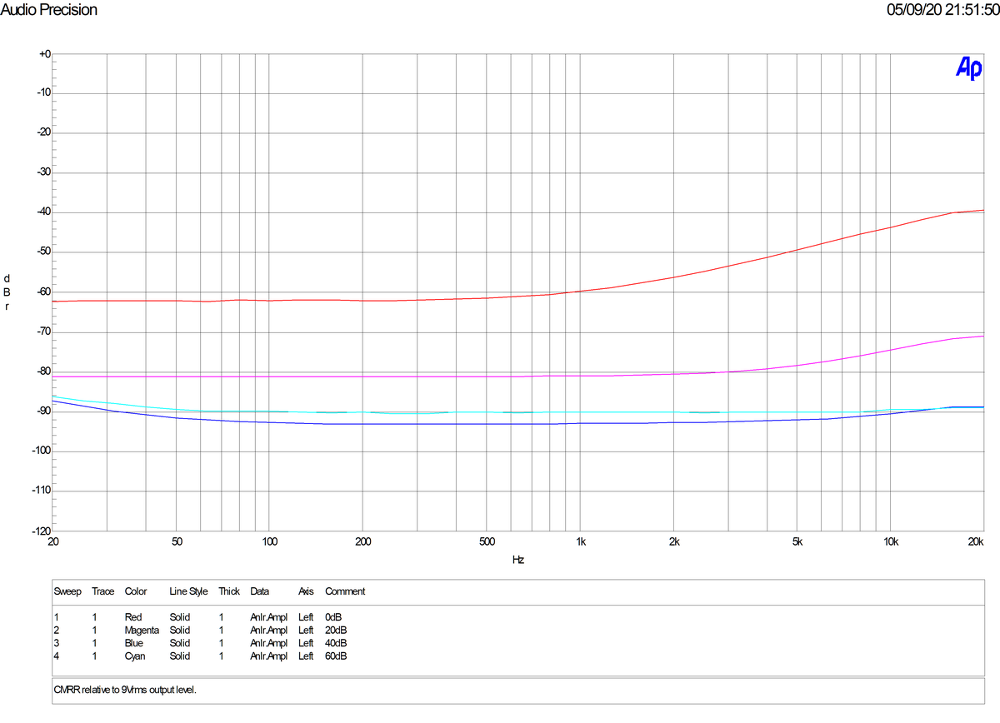
#### THAT1512
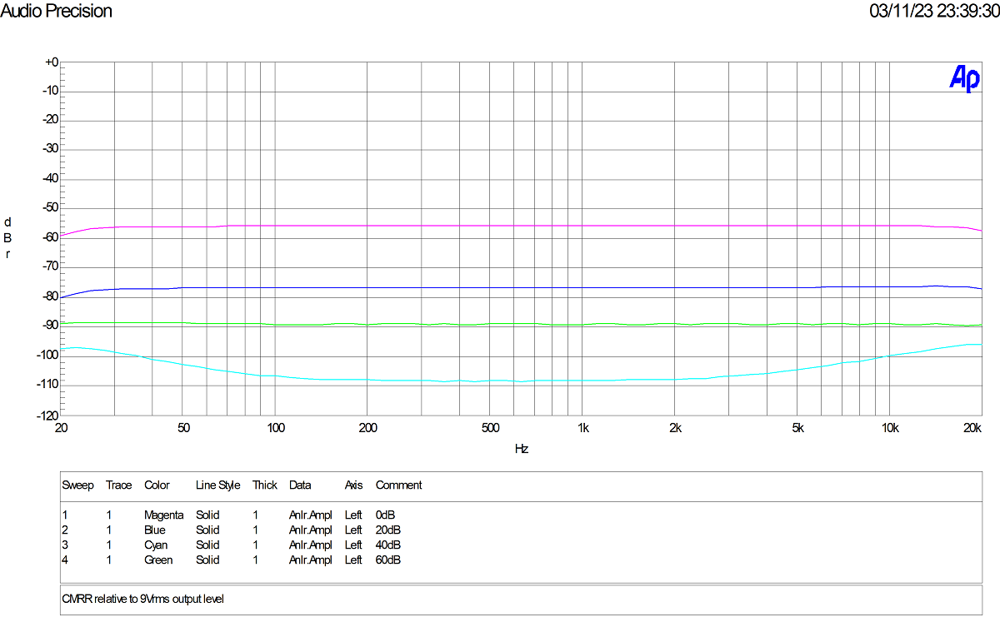

### Bandpass Noise Level
Note no measureable hum.
#### THAT1510
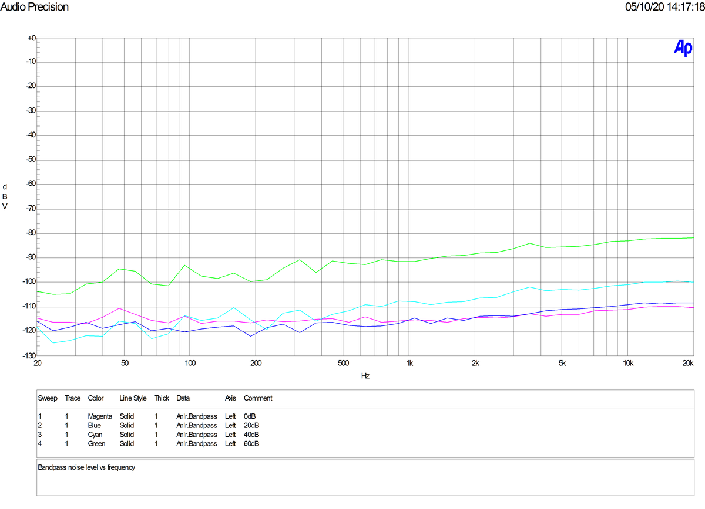
#### THAT1512
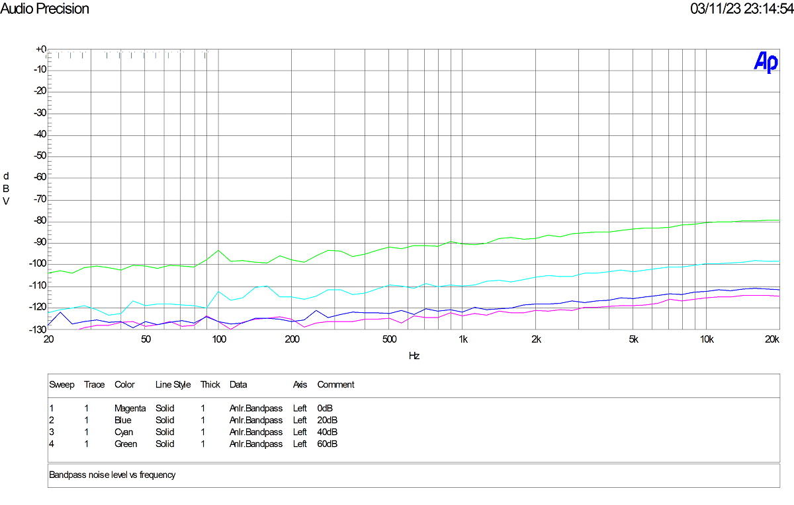

---
OJG 2023
